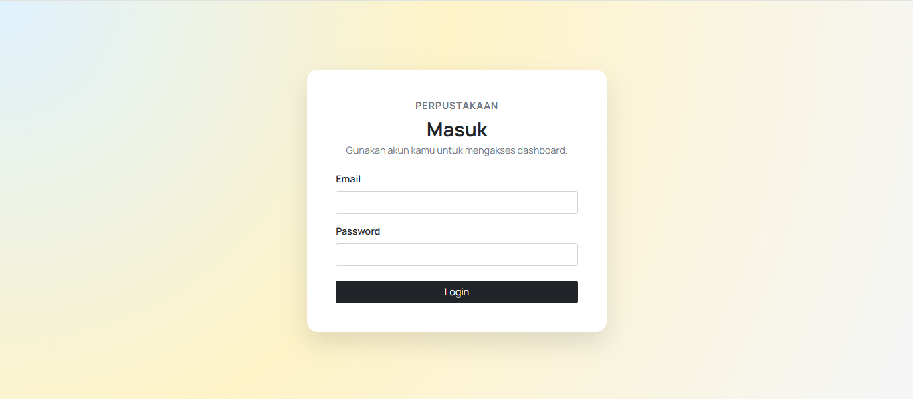
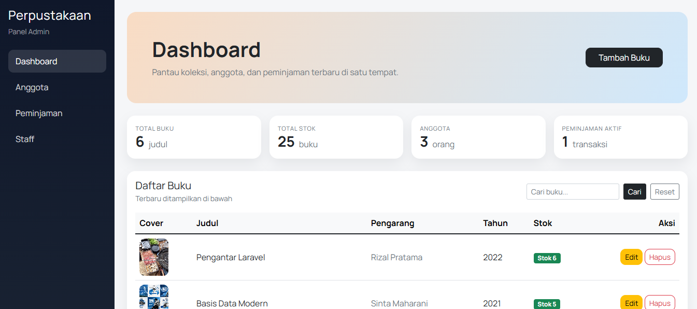
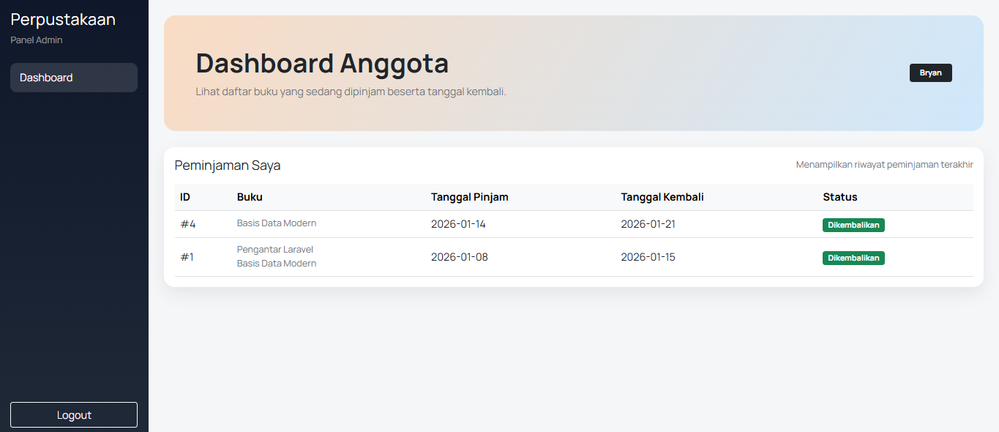
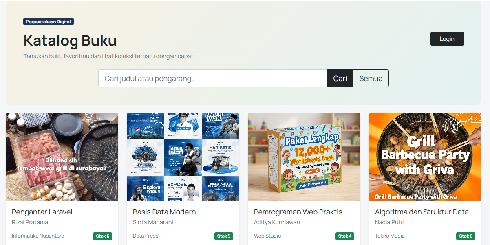
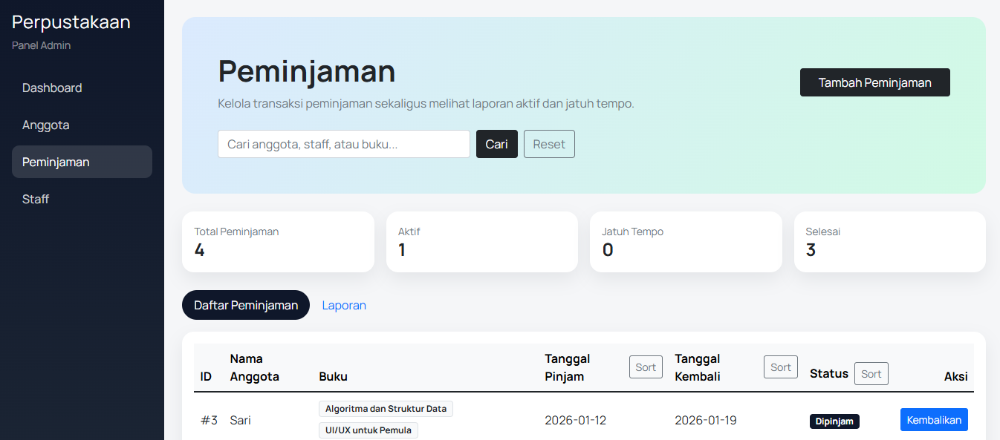
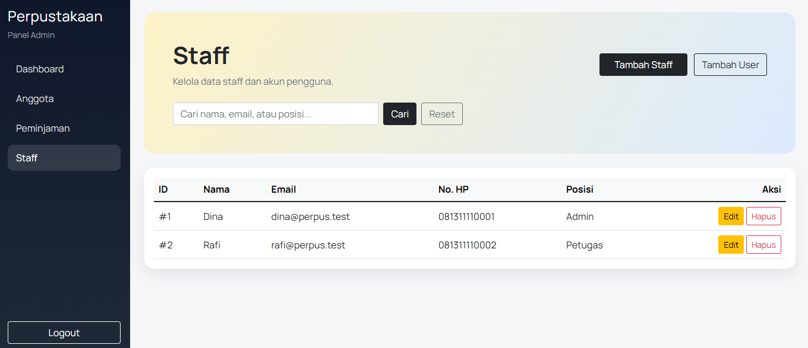

# 📚 Perpustakaan Digital

Website **Perpustakaan Digital** untuk mengelola buku, anggota, staff, dan transaksi peminjaman. Tampilan admin modern, sedangkan anggota mendapatkan dashboard sederhana untuk melihat buku yang dipinjam dan tanggal pengembalian. ✨

---

## 1) 🏷️Review Singkat
**Perpustakaan Digital** adalah aplikasi berbasis web yang memudahkan pengelolaan koleksi buku dan transaksi peminjaman. Fokusnya ada pada workflow yang jelas, tampilan rapi, serta fitur yang relevan untuk admin maupun anggota.

---

## 2) 🗃️ Database (Table & ERD)
**Daftar Tabel & Kolom:**

**1. `users`**
- `id` (PK)
- `name`
- `email` (UNIQUE)
- `email_verified_at` (nullable)
- `password`
- `role`
- `remember_token` (nullable)
- `created_at`
- `updated_at`

**2. `anggota`**
- `id` (PK)
- `nama`
- `no_hp`
- `email`
- `alamat`
- `tgl_bergabung`
- `created_at`
- `updated_at`

**3. `staff`**
- `id` (PK)
- `nama`
- `email` (UNIQUE)
- `no_hp`
- `posisi`
- `created_at`
- `updated_at`

**4. `buku`**
- `id` (PK)
- `judul`
- `pengarang`
- `tahun_terbit`
- `penerbit`
- `stok`
- `gambar` (nullable)
- `created_at`
- `updated_at`

**5. `peminjaman`**
- `id` (PK)
- `id_anggota` (FK -> anggota.id)
- `id_staff` (FK -> staff.id)
- `tgl_pinjam`
- `tgl_kembali`
- `tgl_dikembalikan` (nullable)
- `created_at`
- `updated_at`

**6. `item_peminjaman`**
- `id` (PK)
- `id_peminjaman` (FK -> peminjaman.id)
- `id_buku` (FK -> buku.id)
- `tgl_kembali`
- `created_at`
- `updated_at`

**ERD:**


**Relasi & Kardinalitas:**
- **Anggota → Peminjaman**: *One-to-Many* (1 anggota bisa punya banyak peminjaman).
- **Staff → Peminjaman**: *One-to-Many* (1 staff melayani banyak peminjaman).
- **Peminjaman → Item_Peminjaman**: *One-to-Many* (1 peminjaman punya banyak item buku).
- **Buku → Item_Peminjaman**: *One-to-Many* (1 buku bisa muncul di banyak item peminjaman).
- **Peminjaman ↔ Buku**: *Many-to-Many* melalui tabel penghubung **item_peminjaman**.

---

## 3) 🖼️ Screenshot Preview Page
- Login  
  
- Dashboard Admin  
  
- Dashboard Anggota  
  
- Daftar Buku Dipinjam (Anggota)  
  
- Katalog Buku  
  
- Peminjaman  
  
- Staff  
  

---

## 4) ✅ Fitur Aplikasi
**Untuk Anggota:**
- Melihat daftar buku yang dipinjam
- Melihat tanggal pengembalian
- Melihat status peminjaman (dipinjam/dikembalikan/terlambat)

**Untuk Admin:**
- CRUD Buku
- CRUD Anggota
- CRUD Staff
- Peminjaman & pengembalian buku
- Stok otomatis berkurang/bertambah
- Laporan peminjaman aktif & jatuh tempo (tergabung di halaman Peminjaman)
- Pencarian data (buku, anggota, staff, peminjaman)
- Sorting di kolom peminjaman (tanggal & status)

---

## 5) 🧰 Tech Stack
- **Laravel** (Backend)
- **MySQL** (Database)
- **Bootstrap 5** (UI)
- **jQuery + Select2** (Enhanced select)

---

## 6) 🚀 Quick Start
1. **Clone repo**
   ```bash
   git clone <repo-url>
   cd manageperpus
   ```
2. **Install dependencies**
   ```bash
   composer install
   ```
3. **Setup environment**
   ```bash
   cp .env.example .env
   ```
4. **Konfigurasi DB di `.env`**
   ```env
   DB_CONNECTION=mysql
   DB_HOST=127.0.0.1
   DB_PORT=3306
   DB_DATABASE=perpustakaan
   DB_USERNAME=root
   DB_PASSWORD=
   ```
5. **Generate key**
   ```bash
   php artisan key:generate
   ```
6. **Migrasi database**
   ```bash
   php artisan migrate
   ```
7. **Seed data**
   ```bash
   php artisan db:seed
   ```
8. **Run server**
   ```bash
   php artisan serve
   ```

**Akun default:**
- Admin: `admin@gmail.com` / `password123`
- Anggota: `bryan@example.com` / `password123`

---

## 7) 🧩 OOP Implementation (Contoh + Benefit)
### a) Model & Relasi (Eloquent)
Contoh di `app/Models/Peminjaman.php`:
```php
public function anggota()
{
    return $this->belongsTo(Anggota::class, 'id_anggota');
}

public function itemPeminjaman()
{
    return $this->hasMany(ItemPeminjaman::class, 'id_peminjaman');
}
```
**Benefit:** Relasi antar data menjadi jelas dan mudah diakses, mengurangi query manual.

### b) Controller (Separation of Concerns)
Contoh di `app/Http/Controllers/PeminjamanController.php`:
```php
public function kembali($id)
{
    $peminjaman = Peminjaman::with('itemPeminjaman.buku')->findOrFail($id);
    // ...
}
```
**Benefit:** Logika bisnis terpusat di controller, view tetap bersih dan mudah dirawat.

### c) Model Fillable (Encapsulation)
Contoh di `app/Models/Anggota.php`:
```php
protected $fillable = [
    'nama', 'no_hp', 'email', 'alamat', 'tgl_bergabung',
];
```
**Benefit:** Proteksi data mass assignment, menjaga keamanan input.

### d) Database Seeder (Reusability)
Contoh di `database/seeders/UserSeeder.php`:
```php
User::updateOrCreate(
    ['email' => 'admin@gmail.com'],
    ['name' => 'Admin', 'password' => Hash::make('password123'), 'role' => 'admin']
);
```
**Benefit:** Seed data bisa dijalankan berulang tanpa error, memudahkan testing & setup.

---
